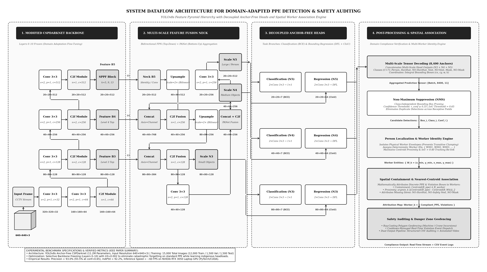

# Real-Time PPE Compliance & Hazard Monitoring (YOLOv8s)

An end-to-end computer vision framework for automated Personal Protective Equipment (PPE) compliance detection and danger-zone monitoring in complex construction environments.



## Key Features
- **Domain Adaptation:** Differentiates indigenous head-carried loads (*ghamelas*, baskets) from safety hardhats.
- **7-Class PPE Detection:** Detects `Hardhat`, `NO-Hardhat`, `Safety Vest`, `NO-Safety Vest`, `Mask`, `NO-Mask`, and `Person`.
- **Multi-Worker Spatial Attribution:** Assigns discrete PPE violations to unique worker IDs (`W001`, `W002`, ...) without cluster collapse.
- **Virtual Geofencing:** Polygon ray-casting alerts for intrusions near heavy machinery/vehicles.
- **Interactive Dashboards:** Full Streamlit web UI + CLI live inference terminal.

## Benchmark Performance
- **Precision:** 93.0% (93.5% at $\tau = 0.65$)
- **mAP@0.50:** 92.2%
- **Inference Speed:** ~15–20 ms (~60 FPS on NVIDIA RTX 3050 GPU)

## Project Structure
```text
├── app_14_09.py                       # Streamlit web dashboard
├── live_inference_demo.py             # Real-time CLI inference demo
├── best.pt                            # Domain-adapted YOLOv8s weights (~6MB)
├── danger_zone_settings.json          # Geofence boundary configuration
├── latest_model_curves/               # PR curves, F1 curves, confusion matrices
└── yolov8_ppe_dataflow_architecture.* # System architectural diagrams
```

## Quickstart

### 1. Installation
```bash
pip install ultralytics streamlit opencv-python pillow pandas torch
```

### 2. Run Web Dashboard
```bash
streamlit run app_14_09.py
```

### 3. Run Live CLI Demo
```bash
# Automated presentation demo sequence
python live_inference_demo.py --demo

# Interactive live stream / webcam
python live_inference_demo.py
```
